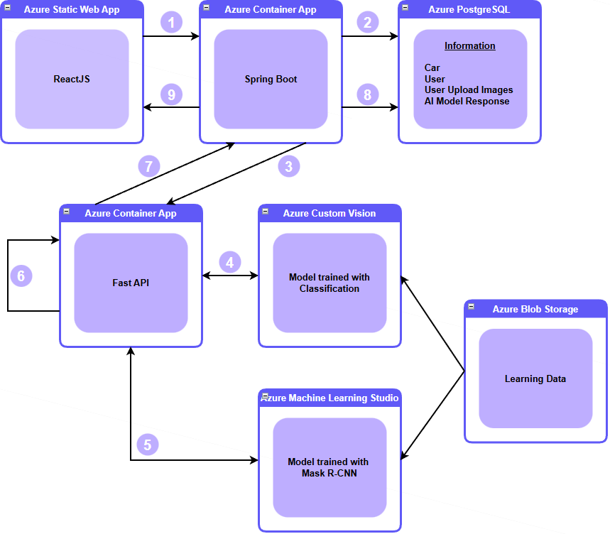
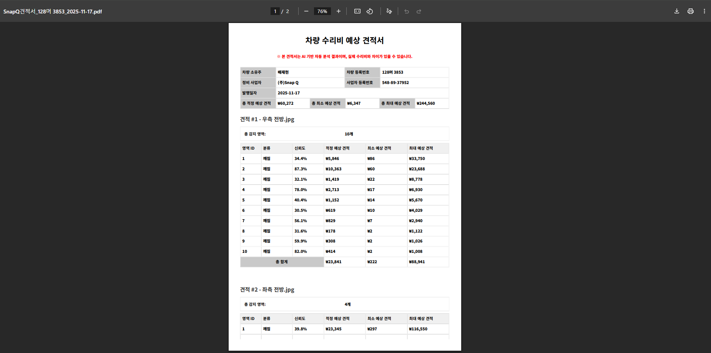

<h1 align="center">
  
  <br>
  SNAP-Q AI Engine
  <br>
</h1>

<p align="center">
  <b>차량 파손 부위 판별 및 수리비 예측 AI 엔진</b>
</p>

<p align="center">
  
  
  
  
</p>

---

### 목차

1. [프로젝트 개요](#1-프로젝트-개요)
2. [주요 기능](#2-주요-기능)
3. [시스템 아키텍처](#3-시스템-아키텍처)
4. [워크플로우](#4-워크플로우)
5. [결과](#5-결과)
6. [기술 스택](#6-기술-스택)
7. [프로젝트 구조](#7-프로젝트-구조)
8. [API 엔드포인트](#8-api-엔드포인트)
9. [인프라 및 배포](#9-인프라-및-배포)
10. [환경 설정 및 실행 방법](#10-환경-설정-및-실행-방법)
    
---

## 1. 프로젝트 개요

### 소개

**SNAP-Q AI Engine**은 차량 파손 이미지를 분석하여 파손 유형을 분류하고, 파손 영역을 탐지한 뒤, 수리비를 예측하는 FastAPI 기반 AI 서비스입니다.

Azure Custom Vision(분류 모델)과 Mask R-CNN(객체 탐지 모델) 두 가지 AI 모델을 결합하여 파손 부위의 종류, 위치, 면적을 분석하고, 이를 바탕으로 수리비 견적을 산출합니다.

### SNAP-Q 전체 시스템에서의 역할

이 프로젝트는 SNAP-Q 전체 시스템의 **AI 추론 엔진** 부분을 담당합니다.

React 프론트엔드에서 사용자가 파손 이미지를 업로드하면, Spring Boot 서버가 이미지를 본 FastAPI 서버로 전달합니다. FastAPI 서버는 AI 모델을 통해 분석을 수행하고, 견적 결과를 Spring Boot 서버에 응답합니다.

> **Spring Boot 프로젝트**: [snapQ-spring](https://github.com/jaehyeon0420/snapQ-spring)

### 프로젝트는 8일간 진행되었으며, 총 6명의 팀원이 아래와 같이 역할을 담당하였습니다.

| 이름 | 담당 역할 |
|---|---|
| 배재현(본인) | **백엔드 개발, DB 설계 및 구축, CI/CD 파이프라인 구축** |
| 곽*령 | 프로젝트 매니저, 시장 분석, 비즈니스 모델 검토 |
| 문*준 | UI/UX 기획 및 프론트엔드 개발 |
| 이*승 | 데이터 전처리(차량 이미지 탐샋 및 정제) |
| 이*균 | Azure Custom Vision 모델 학습 및 최적화 |
| 김*열 |  Mask R-CNN 모델 학습 및 최적화, 견적 산출 로직 설계|

---

## 2. 주요 기능

- [목차로 돌아가기](#목차)
  
| 기능 | 설명 |
|------|------|
| **파손 유형 분류** | Azure Custom Vision을 활용하여 긁힘, 찌그러짐, 깨짐, 도색손상 4가지 유형으로 분류 |
| **파손 영역 탐지** | Mask R-CNN 모델로 이미지 내 파손 영역의 위치와 크기를 바운딩 박스로 탐지 |
| **수리비 예측** | 두 모델의 신뢰도를 결합하여 최소/최대/추천 수리비를 산출 |
| **결과 시각화** | 파손 영역에 바운딩 박스, 유형 라벨, 신뢰도, 비용 정보를 표시한 이미지 생성 |
| **다중 이미지 처리** | 여러 장의 파손 이미지를 한 번에 분석하여 ZIP 파일로 결과 반환 |

### 비용 산출 기준

| 파손 유형 | 한글 | 단위 비용 (px²당) |
|-----------|------|-------------------|
| Scratched | 긁힘 | 100원 |
| Crushed | 찌그러짐 | 200원 |
| Breakage | 깨짐 | 300원 |
| Separated | 도색손상 | 150원 |

---

## 3. 시스템 아키텍처

- [목차로 돌아가기](#목차)
  
<p align="center">
  
</p>

**처리 흐름**

1. ReactJS 프론트엔드에서 파손 이미지 업로드
2. Spring Boot가 이미지 메타데이터를 PostgreSQL에 저장
3. Spring Boot가 FastAPI로 이미지 전달 (REST API)
4. Azure Custom Vision으로 파손 유형 분류
5. Mask R-CNN으로 파손 영역 탐지
6. 두 모델의 결과를 결합하여 수리비 견적 산출
7. 분석 결과(견적 JSON + 시각화 이미지)를 Spring Boot에 응답
8. Spring Boot가 견적 결과를 PostgreSQL에 저장
9. ReactJS 프론트엔드에 결과 출력

---

## 4. 워크플로우

- [목차로 돌아가기](#목차)

<p align="center">
  
</p>

```
사용자 이미지 업로드
    └─ Spring Boot → FastAPI 이미지 전달
        └─ [Model 1] Azure Custom Vision 분류
            └─ 긁힘 / 찌그러짐 / 깨짐 / 도색손상 확률 반환
        └─ [Model 2] Mask R-CNN 탐지
            └─ 파손 영역 바운딩 박스 + 타입 + 신뢰도
        └─ 두 모델 결과 결합 → 비용 계산
            └─ min_cost = base_cost × min(model1_prob, model2_conf)
            └─ max_cost = base_cost × min(1.0, min_conf + combined_uncertainty)
            └─ recommended_cost = base_cost × avg(model1_prob, model2_conf)
        └─ 결과 ZIP 생성 (result.json + 시각화 이미지)
    └─ Spring Boot ← FastAPI 응답
```

---

## 5. 결과

- [목차로 돌아가기](#목차)
  
### 파손 영역 탐지 결과 이미지

분석된 이미지에 바운딩 박스, 파손 유형, 신뢰도, 비용 정보가 시각화됩니다.

<p align="center">
  
</p>

- 신뢰도 50% 이상: 🟢 초록 / 40~50%: 🟠 주황 / 30~40%: 🟡 노랑 / 30% 이하: 🔴 빨강
- 각 바운딩 박스에 파손 유형, 신뢰도, 추천 수리비 표시
- 이미지 상단에 총 견적 금액 표시

### 수리비 견적 보고서

사용자는 견적 결과를 PDF 형태로 다운로드 받을 수 있습니다.

<p align="center">
  
</p>

<details>
<summary>견적 JSON 응답 예시</summary>

```json
{
  "image_file": "20260110212257146_02275.jpg",
  "image_size": [800, 1067],
  "model1_probabilities": {
    "긁힘": 0.6698,
    "도색손상": 0.2795,
    "찌그러짐": 0.0482,
    "깨짐": 0.0026
  },
  "total_detections": 4,
  "regions": [
    {
      "id": 1,
      "type": "breakage",
      "type_kr": "깨짐",
      "area": 38850,
      "bbox": { "x1": 336, "y1": 661, "x2": 595, "y2": 811 },
      "base_cost": 116550.0,
      "min_cost": 297.26,
      "max_cost": 116550.0,
      "recommended_cost": 23345.96,
      "confidence": {
        "min": 0.0026,
        "max": 1.0,
        "recommended": 0.2003,
        "model1_prob": 0.0026,
        "model2_conf": 0.3981
      }
    }
  ],
  "summary": {
    "total_min_cost": 6121,
    "total_max_cost": 155619,
    "total_recommended_cost": 36425
  },
  "unit_costs": {
    "긁힘": 100,
    "찌그러짐": 200,
    "깨짐": 300,
    "도색손상": 150
  }
}
```

</details>

---

## 6. 기술 스택

- [목차로 돌아가기](#목차)
  
| 분류 | 기술 |
|------|------|
| **Framework** | FastAPI, Uvicorn |
| **AI/ML** | PyTorch, TorchVision (Mask R-CNN), Azure Custom Vision |
| **이미지 처리** | Pillow, Matplotlib |
| **설정 관리** | Pydantic Settings, python-dotenv |
| **컨테이너** | Docker |
| **CI/CD** | Jenkins |
| **인프라** | Azure Container Apps, Azure Container Registry |
| **Language** | Python 3.11 |

---

## 7. 프로젝트 구조

- [목차로 돌아가기](#목차)
  
```
fastapiproject/
├── main.py                              # FastAPI 애플리케이션 진입점
├── requirements.txt                     # Python 의존성 패키지
├── Dockerfile                           # Docker 컨테이너 설정
├── Jenkinsfile                          # Jenkins CI/CD 파이프라인
├── logging.yaml                         # 로깅 설정
├── .env                                 # 환경 변수 (gitignore)
│
├── app/
│   ├── api/
│   │   └── estimate.py                  # API 엔드포인트 (Controller)
│   │
│   ├── core/
│   │   └── config.py                    # 환경 변수 설정 관리
│   │
│   ├── service/
│   │   ├── estimate_cv_service.py       # Azure Custom Vision 분류 서비스
│   │   └── estimate_ml_service.py       # Mask R-CNN 탐지 + 비용 산출 서비스
│   │
│   ├── model/
│   │   ├── maskrcnn_model_re_final.pth  # Mask R-CNN 학습 모델 가중치
│   │   └── damage_type_mapping.json     # 손상 타입 매핑 (ID ↔ 영문)
│   │
│   ├── uploads/                         # 업로드 이미지 임시 저장 (gitignore)
│   └── ml_outputs/                      # ML 추론 결과 저장 (gitignore)
│       ├── {timestamp}_{id}_cost.json       # 비용 견적 JSON
│       ├── {timestamp}_{id}_inference.json  # 탐지 결과 JSON
│       └── {timestamp}_{id}_image.jpg       # 시각화 이미지
```

---

## 8. API 엔드포인트

- [목차로 돌아가기](#목차)
  
### `POST /mycar/estimate`

차량 파손 이미지를 분석하여 수리비 견적을 산출합니다.

**Request**

| 파라미터 | 타입 | 설명 |
|---------|------|------|
| `files` | `List[UploadFile]` | 파손 이미지 파일 목록 (multipart/form-data) |
| `filePathList` | `List[str]` | 파일 경로 목록 (JSON 문자열, Form) |

**Response**

- Content-Type: `application/zip`
- 파일명: `result.zip`

| ZIP 내부 파일 | 설명 |
|--------------|------|
| `result.json` | 모든 이미지의 비용 견적 결과 통합 JSON |
| `{timestamp}_{id}_image.jpg` | 각 이미지별 파손 영역 시각화 이미지 |

**요청 예시 (cURL)**

```bash
curl -X POST "http://localhost:8000/mycar/estimate" \
  -F "files=@damage_photo.jpg" \
  -F 'filePathList=["20260110212257146_02275.jpg"]' \
  --output result.zip
```

---

## 9. 인프라 및 배포

- [목차로 돌아가기](#목차)
  
<p align="center">
  
</p>

### CI/CD 파이프라인

Jenkins를 통해 자동화된 빌드 및 배포 파이프라인이 구성되어 있습니다.

```
GitHub Push → Jenkins Pipeline
  ├─ Cleanup Workspace
  ├─ Checkout Code (master branch)
  ├─ Build Docker Image
  └─ Login to Azure & Push to ACR
       └─ Azure Container Registry (backprojectacr.azurecr.io)
            └─ Azure Container Apps 배포
```

### 배포 환경

| 항목 | 설정 |
|------|------|
| **컨테이너 레지스트리** | Azure Container Registry (`backprojectacr.azurecr.io`) |
| **컨테이너 런타임** | Azure Container Apps |
| **베이스 이미지** | `python:3.11-slim` |
| **포트** | 8000 |
| **인증** | Azure Service Principal |

---

## 10. 환경 설정 및 실행 방법

- [목차로 돌아가기](#목차)
  
### 사전 요구 사항

- Python 3.11+
- Azure Custom Vision 리소스 (Prediction API Key, Endpoint)
- Mask R-CNN 학습 모델 파일 (`maskrcnn_model_re_final.pth`)

### 환경 변수 설정

프로젝트 루트에 `.env` 파일을 생성합니다.

```env
CUSTOM_VISION_KEY=<Azure Custom Vision API Key>
CUSTOM_VISION_ENDPOINT=<Azure Custom Vision Endpoint URL>
CUSTOM_VISION_PROJECT_ID=<Custom Vision Project ID>
CUSTOM_VISION_MODEL_NAME=<Custom Vision Published Model Name>
MODEL_BLOB_URL=<Mask R-CNN 모델 파일 Azure Blob URL>
```

### 로컬 실행

```bash
# 1. 가상 환경 생성 및 활성화
python -m venv venv
source venv/bin/activate  # Windows: venv\Scripts\activate

# 2. 의존성 설치
pip install -r requirements.txt

# 3. 모델 파일 배치
# maskrcnn_model_re_final.pth 파일을 app/model/ 디렉토리에 배치

# 4. 서버 실행
uvicorn main:app --host 0.0.0.0 --port 8000 --reload
```

### Docker 실행

```bash
# 이미지 빌드
docker build -t snap-q-ai-engine .

# 컨테이너 실행
docker run -d \
  --name snap-q-ai \
  -p 8000:8000 \
  --env-file .env \
  snap-q-ai-engine
```

### API 문서

서버 실행 후 아래 주소에서 Swagger UI를 확인할 수 있습니다.

- Swagger UI: `http://localhost:8000/docs`
- ReDoc: `http://localhost:8000/redoc`


